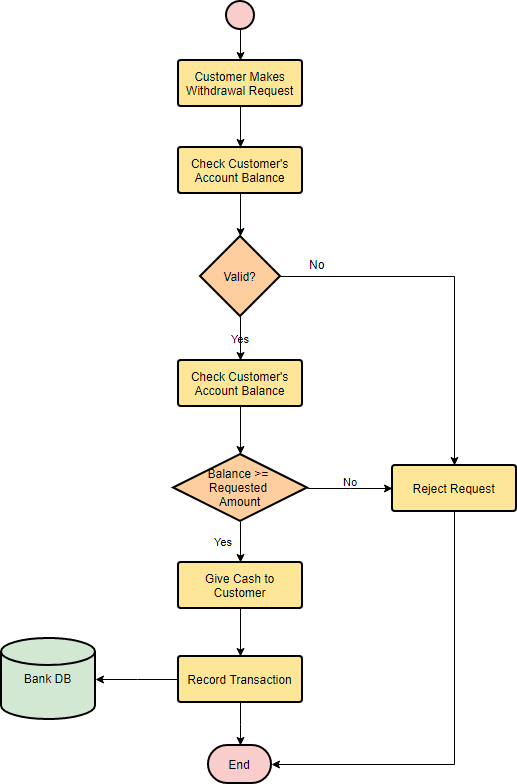

# Introduction to Programming

## What is Programming?

*Programming is the process of designing and building an executable computer program to accomplish a specific computing task*

### Notes

* Programming is about problem-solving.
* Involves giving instructions to a computer to perform specific tasks
* The sequence of instructions or tasks is often referred to as an algorithm.
* In fullstack web development, programming shapes both what users interact with (front end) and what happens behind the scenes (back end)

---

## Why is it essential?

* Everything, from microwaves to spaceships, uses some form of programming.
* It provides the backbone for all digital technologies that have revolutionized our lives.
* Enables automation, reducing human error, and increasing efficiency.

---

## Real-world examples of programming

* E-commerce Sites: A blend of user experience and complex data management.
* Social Media Platforms
* Blogs & Personal Websites
* Web Apps: Delivering powerful software right through the browser, without the need to install anything. like Google Docs, Trello, Discord, etc.
