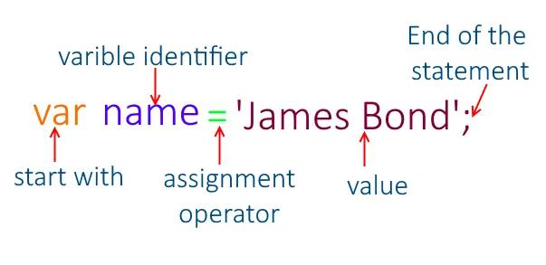

# Javascript Vriable

## 1. What is a variable?

This a variable as a box where we can store a value. this value can be a simple number, a string of text, or even a more complex data structure like an array or an object.


A variable is a container for a value, like a number we might use in a sum, or a string of text that we might include in a sentence.

## 2. Why do we need variables?

Variables are useful because they allow us to write flexible programs. Instead of having to write out the same value over and over, we can use a variable to assign the value to a word, and then use the word over and over.

## 3. How to declare a variable?

To declare a variable, we use the keyword `var` followed by the name we want to call our variable:

```js
var myVariable;
```

## 4. How to assign a value to a variable?

To assign a value to a variable, we use the equals sign `=` followed by the value we want to assign to the variable:

```js
var myVariable = "Bob";
```

In the example above, we have assigned the value `'Bob'` to the variable `myVariable` at declaration.

We can also assign a value to an existing variable:

```js
var myVariable = "Bob";
myVariable = "Steve";
```

In the example above, we have assigned the value `'Bob'` to the variable `myVariable` at declaration, and then changed the value to `'Steve'` on the second line. This is because we have not used the keyword `var` on the second line, so we are not declaring a new variable, we are just assigning a new value to the existing variable.



A variable can be assigned the value of another variable:

```js
var myVariable = "Bob";
var myOtherVariable = myVariable;
console.log(myOtherVariable); // Output: Bob
```

In the example above, we have assigned the value `'Bob'` to the variable `myVariable` at declaration, and then assigned the value of `myVariable` to `myOtherVariable` on the second line, so `myOtherVariable` now has the value `'Bob'`.

## 5. Rules for naming variables

There are a few rules we need to follow when naming variables:

- Variable names must begin with a letter, `$`, or `_`. For this reason, we usually use camelCase when naming variables with more than one word.
- Variable names cannot contain spaces.
- Variable names cannot contain hyphens `-`.
- Variable names are case sensitive, so `myVariable` and `myvariable` are different variables.
- Variable names cannot be any of JavaScript's reserved keywords, like `var`, `if`, `else`, `for`, etc. (You will learn more about these keywords later in the course.)

### Examples of valid variable names

```js
var myVariable;
var myOtherVariable;
var myVariable2;
var $myVariable;
var _myVariable;
var 2IncorrectVariableName; // This is invalid because it begins with a number
var my-variable; // This is invalid because it contains a hyphen
var my variable; // This is invalid because it contains a space
```

## 6. Variable naming conventions

There are a few conventions we should follow when naming variables:

- Variable names should be descriptive and meaningful.
- Variable names should be written in camelCase.
- Variable names should not be too long.
- Variable names should not start with capital letters.
- Variable names should not start with `$` or `_` unless they are being used for a specific purpose (Wil be explained later in the course)
- Variable names should not be too similar to each other.

### Examples of good variable names

```js
var firstName;
var lastName;
var age;
var address;
var dateOfBirth;
var myVariable; // This is not a good variable name because it is not descriptive
var my_variable; // This is not a good variable name because it is not camelCase
var myVariableNameIsTooLong; // This is not a good variable name because it is too long
var MyVariable; // This is not a good variable name because it starts with a capital letter
var $myVariable; // This is not a good variable name because it starts with a dollar sign
var _myVariable; // This is not a good variable name because it starts with an underscore
var myVariable; // This is not a good variable name because it is too similar to the variable below
var myvariable; // This is not a good variable name because it is too similar to the variable above
```

## 7. Variable types (Data types)

### Javascript has 8 data types

- `undefined` - represents lack of existence (you should never set a variable to this) e.g. `var a;`
- `null` - represents lack of existence (you can set a variable to this) e.g. `var a = null;`
- `boolean` - true or false (no quotes) e.g. `var a = true;`
- `number` - floating point number (there's always some decimals). Unlike other programming languages, there's only one number type in JavaScript and it can make math weird. e.g. `var a = 1;`
- `string` - a sequence of characters (both '' and "" can be used) e.g. `var a = "hello world";`
- `symbol` - used in ES6 (newer version of JavaScript) e.g. `var sym = Symbol('foo');`
- `object` - key value pairs (like a dictionary in Python) e.g. `var a = {};`
- `bigint` - larger integers than the Number type can hold e.g. `var a = 1234567890123456789012345678901234567890n;` (the `n` at the end is what makes it a BigInt)

#### Object types

The Object type is a special type in JavaScript. It is a collection of key-value pairs. We will learn more about objects later in the course.

- `array` - a list of items. e.g. `var a = [1, 2, 3];`
- `date` - a date and time. e.g. `var a = new Date();`
- `object` - a collection of properties. e.g. `var a = { foo: 'bar' };`

**Example:**

```js
// Numbers:
var length = 16;
var weight = 7.5;

// Strings:
var color = "Yellow";
var lastName = "Johnson";

// Booleans
var x = true;
var y = false;

// Object:
const person = { firstName: "John", lastName: "Doe" };

// Array object:
const cars = ["Saab", "Volvo", "BMW"];

// Date object:
const date = new Date("2022-03-25");
```

**Reference**: [JavaScript Data Types](https://www.w3schools.com/js/js_datatypes.asp)

## 8. Variable Types are Dynamic

JavaScript is a dynamically typed language. This means that you don't have to specify what type of information a variable contains, but sometimes it can be useful to know it.

You can use the `typeof` operator to find the type of a JavaScript variable.

**Example**

```js
var length = 16; // Number

console.log(typeof length); // Output: number

var lastName = "Johnson"; // String

console.log(typeof lastName); // Output: string
```

You can assign a `number` to a variable, and later assign a `string` to the same variable:

**Example**

```js
var length = 16; // Number
console.log(length); // Output: 16
console.log(typeof length); // Output: number

length = "Johnson"; // String
console.log(length); // Output: Johnson
console.log(typeof length); // Output: string
```

## 9. Simple Practice

1. **Basic Declarations**

   - Declare a variable called name and assign it your name.
   - Declare a variable called age and assign it your age.
   - Declare a variable called isStudent and assign it a boolean value (true or false).

2. **Switcheroo**

   - Declare a variable `a` and assign it a value of `5`.
   - Declare a variable `b` and assign it a value of `true`.
   - Declare a variable `c` and assign it the value of `a`.
   - Assign the value of `b` to `a`.
   - Assign the value of `c` to `b`.
   - Print the values of `a`, `b`. What do you expect to see?

3. **What's the type?**

   - Declare a variable `a` and assign it a value of `5`.
   - Declare a variable `b` and assign it a value of `true`.
   - Print the type of `a`.
   - Print the type of `b`.
